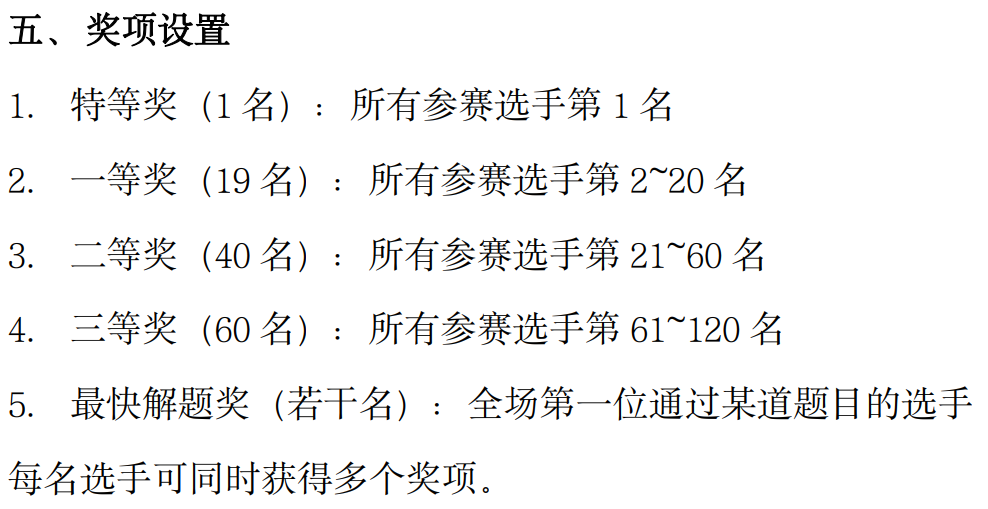
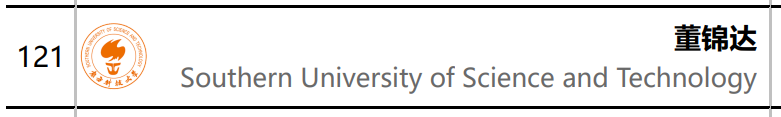

### Hi there 👋

相逢便是缘分。笨人无才无能，恳请佬带飞（）

- 🔭 I’m currently working on the classical feedback controlling. 
- 🌱 I’m currently learning the basic principle of machine learning.

Honors

<b>Glad News</b>

<b>喜 报</b>

Congratulations to the owner of this repo for winning the **first** **place** of SUSTech CPC Competition **participation Award**.(Guess who is the joker)

祝贺本仓库所有者在SUSTech CPC中荣获**参与第一名**！（幽默小丑）

<!--
**Ethylene9160/Ethylene9160** is a ✨ _special_ ✨ repository because its `README.md` (this file) appears on your GitHub profile.

Here are some ideas to get you started:

- 🔭 I’m currently working on ...
- 🌱 I’m currently learning ...
- 👯 I’m looking to collaborate on ...
- 🤔 I’m looking for help with ...
- 💬 Ask me about ...
- 📫 How to reach me: ...
- 😄 Pronouns: ...
- ⚡ Fun fact: ...
-->
